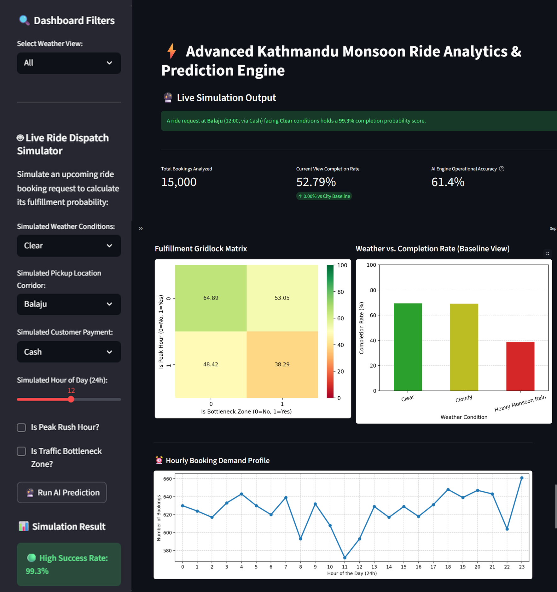

# 🌧️ Advanced Kathmandu Monsoon Ride Analytics & Prediction Engine

🌐 **Live Deployed Application:** [Kathmandu Monsoon Predictive Engine Link](https://kathmandu-monsoon-predictive-engine.streamlit.app/)

---

## 📌 Overview

**Kathmandu Monsoon Predictive Engine** is an end-to-end Data Science and Machine Learning engineering project designed to analyze and optimize ride-sharing fulfillment performance under challenging monsoon conditions in Kathmandu, Nepal.

The system combines rigorous statistical modeling, historical weather shock hypothesis testing, and a pre-trained machine learning pipeline hooked into an interactive business intelligence dashboard. This allows platform operators to identify severe environmental bottlenecks and predict fulfillment probabilities before a ride is dispatched.

Built using Python, Scikit-Learn, StatsModels, and Streamlit, this repository demonstrates a complete production-grade data engineering workflow—advancing from exploratory notebooks to a modular, deployment-ready asset structure.

---

## 🎯 Business Problem

Urban mobility and ride-sharing networks operating in Kathmandu face severe operational drops during the annual monsoon season. Overlapping risk factors include:
* 🌧️ **Sudden Heavy Rainfall Downpours:** Drastically lowering structural fleet supply.
* 🚦 **High-Risk Traffic Bottleneck Zones:** Causing severe local localization delays.
* ⏰ **Peak-Hour Traffic Gridlock:** Compounding spatial constraints during office commute windows.
* 💳 **Digital Payment Gateway Friction:** Spiking transaction timeouts and settlement dropouts.

These factors combine to drive up ride cancellation rates, strand riders, and degrade platform revenue. This engine inspects these factors to provide predictive dispatch capabilities and data-driven operational strategies.

---

## 📊 Project Objectives

* **Quantify Weather Shock:** Measure the statistical significance of monsoon downpours vs. clear skies on completion metrics.
* **Map Situational Gridlocks:** Evaluate the combined, multi-variable impact of peak-hour traffic and known bottleneck sectors.
* **Surface Transaction Friction:** Audit payment methods to calculate confidence intervals for failure risks.
* **Deploy Predictive AI Infrastructure:** Train a highly predictive classifier to run instant dispatch safety scoring.
* **Build an Interactive Workspace:** Construct a clean, desktop-view dashboard to serve live simulation data.

---

## 🔬 Analytical Framework

### Phase 1: Transaction Friction Analysis
* **Objective:** Determine if specific payment channels correlate with completed ride pipelines.
* **Methodology:** Binomial Distribution metrics, explicit Completion Rate Estimation, and 95% Confidence Interval scaling.
* **Insight:** Pinpoints cash vs. digital transaction gateways showing elevated payment failures during stormy intervals.

### Phase 2: Weather Shock Impact Analysis
* **Objective:** Confirm if adverse weather drops ride fulfillment beyond normal variance.
* **Statistical Method:** Two-Proportion Z-Test.
* **Empirical Results:**
  * **Z-Statistic:** 28.54
  * **P-Value:** < 0.001
* **Conclusion:** Highly significant. Reject the Null Hypothesis. Weather changes fundamentally dictate operational constraints.

### Phase 3: Situational Gridlock Matrix Analysis
* **Objective:** Cross-examine how spatial constraints (Bottleneck Zones) and temporal constraints (Peak Hours) compound.
* **Methodology:** Contingency tables and conditional probability profiling to build a gridlock risk matrix.

### Phase 4: AI Dispatch Prediction Engine
* **Machine Learning Model:** Random Forest Classifier (`sklearn.ensemble`).
* **Deployment Optimization:** The model is fully trained off-line inside the research sandbox and serialized to a standalone binary file (`models/random_forest_model.pkl`) using Python's pickle library, bypassing runtime training overhead in production.

---

## 🛠️ Technology Stack

* **Programming & Core Engine:** Python
* **Data Transformation & Matrix Arrays:** Pandas, NumPy
* **Statistical Inference Modeling:** SciPy (Stats), StatsModels
* **Machine Learning & Weights Extraction:** Scikit-Learn
* **UI Interface & Web Hosting Server:** Streamlit
* **Development Environment Workspace:** Jupyter Notebook / Anaconda

---

## 📂 Project Structure

```text
kathmandu-monsoon-predictive-engine/
│
├── app.py                      # Main Streamlit web application engine
├── requirements.txt            # Python environment library definitions
├── README.md                   # Storefront documentation (This file)
│
├── data/
│   └── kathmandu_monsoon_rides.csv  # Primary analytical dataset (15k records)
│
├── notebooks/
│   └── customerdata.ipynb      # EDA sandbox, statistical test cells, and ML training loops
│
├── models/
│   └── random_forest_model.pkl # Pre-trained, serialized production model weights
│
├── images/
│   └── dashboard_home.png      # Perfected PC desktop layout composite visual
│
└── outputs/
    ├── model_metrics.csv       # Exported precision, recall, and accuracy logs
    └── statistical_results.csv # Saved Z-statistic and hypothesis testing results

 ```

## ⚙️ Installation & Running Locally

### 1. Clone the Repository
```bash
git clone [https://github.com/Sakshyam-7/kathmandu-monsoon-predictive-engine.git](https://github.com/Sakshyam-7/kathmandu-monsoon-predictive-engine.git)
cd kathmandu-monsoon-predictive-engine


### 2. Install Project Dependencies
```bash
pip install -r requirements.txt

### 3. Launch the Application Interface
```bash
streamlit run app.py

The interface will automatically boot up inside your local web browser workspace at: `http://localhost:8501`

---
```
## 📷 Production Dashboard Preview

### Integrated Desktop Workspace
Below is the clean desktop view of the final application layout. It cleanly integrates structural controls, real-time metrics, heatmaps, and the live behavioral prediction engine simulator:



---

## 💼 Portfolio Highlights Demonstrated
* **Modular Pipeline Architecture:** Clean separation of data assets (`data/`), model weights (`models/`), exploratory code (`notebooks/`), and visual frontends (`app.py`).
* **Statistical Rigor:** Moving beyond simple visualizations into hypothesis verification ($Z$-tests and confidence boundary calculations).
* **Binary Serialization Deployment:** Offloading resource-intensive model training loops into an offline file asset for optimized cloud execution.

---

## 👨‍💻 Author
**Sakshyam Bhandari** *Computer Engineering Student | Emerging Data & Business Analyst*

* **Technical Core:** Python, SQL, Machine Learning, Statistical Inference, Advanced Excel, Power BI, Streamlit.
* **Connect with Me:** [LinkedIn](https://www.linkedin.com/in/sakshyam-bhandari/) | [GitHub Profile](https://github.com/Sakshyam-7)

***

*If you found this technical implementation compelling, please consider leaving a ⭐ star on this GitHub repository to support my engineering journey!*
